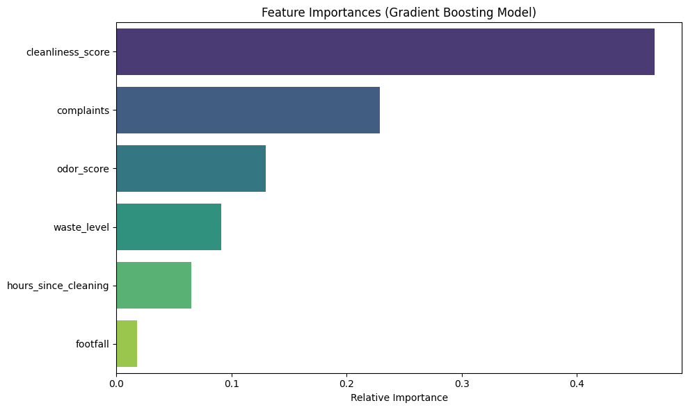

<!--• Project Overview • Problem Statement • Features • Technology Stack • Architecture • Database Design, where applicable • API Documentation, where applicable • Installation • Environment Variables • How to Run • Screenshots, where applicable • Challenges Faced • Solutions • Future Improvements -->

# Facility Hygiene Machine Learning Pipeline

## Overview
This pipeline predicts facility hygiene risk levels (Low, Medium, High) based on various operational metrics. The project is broken down into modular components covering EDA, preprocessing, training, prediction, and evaluation.

## Selected Model & Features
- **Target Variable:** `hygiene_risk` (Categorical: Low, Medium, High)[cite: 1]
- **Features Used:** `cleanliness_score`, `odor_score`, `waste_level`, `complaints`, `footfall`, `hours_since_cleaning`[cite: 1]
- **Models Compared:** Random Forest Classifier and Gradient Boosting Classifier[cite: 1]

## Performance & Summary
- **Random Forest Classifier:** 87.44% Accuracy
  - High Risk: Precision 0.93, Recall 0.82, F1-score 0.87
  - Low Risk: Precision 0.91, Recall 0.91, F1-score 0.91
  - Medium Risk: Precision 0.82, Recall 0.89, F1-score 0.85
- **Gradient Boosting Classifier (Best Performer):** 87.94% Accuracy
  - High Risk: Precision 0.93, Recall 0.84, F1-score 0.88
  - Low Risk: Precision 0.91, Recall 0.91, F1-score 0.91
  - Medium Risk: Precision 0.83, Recall 0.89, F1-score 0.86

## Feature Importance
according to best performer algorithm `GradientBoostingClassifier`

## How to run?
- have python >=v3.14 installed
- aquire `day-04` project directory, `cd` into it
- run `pip install -r requirements.txt`
- execute `python main.py`

## Problems Encountered & Potential Improvements
1. **Class Confusion (Medium Risk):** The precision for "Medium" is slightly lower (0.82 - 0.83) compared to High and Low, as it sits on the boundary. Generating interaction terms such as `cleanliness_score` weighted by `hours_since_cleaning` could help separate these edge cases.
2. **Feature Importance:** Feature importance analysis showed that `cleanliness_score` and `complaints` are the strongest predictors of hygiene risk.
3. **Optimization:** Hyperparameter tuning using `GridSearchCV` or `RandomizedSearchCV` on Gradient Boosting could further optimize performance.
